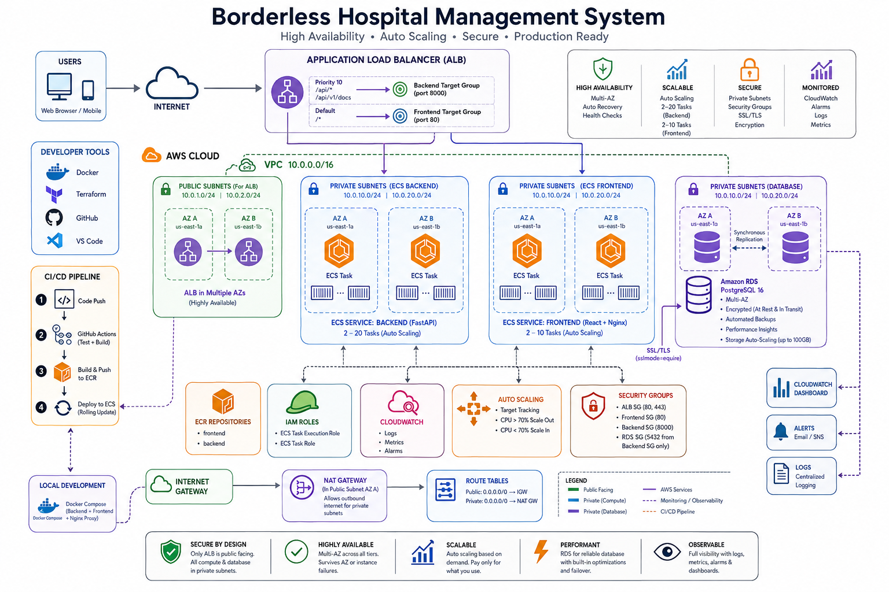

# Borderless Hospital Management System (HMS)

A full-stack hospital management system built with FastAPI and React, containerised with Docker, and deployed to AWS using Terraform and ECS Fargate. Includes a CI/CD pipeline via GitHub Actions and load testing with Locust.

---

## Architecture

```
Internet → ALB → ECS Frontend (React/Nginx)
               → ECS Backend (FastAPI) → RDS PostgreSQL
```

| Resource | Details |
|----------|---------|
| Compute | ECS Fargate |
| Database | RDS PostgreSQL 16, Multi-AZ |
| Load Balancer | Application Load Balancer (ALB) |
| Container Registry | Amazon ECR |
| Networking | VPC with public/private subnets across 2 AZs |
| Monitoring | CloudWatch Logs + Alarms |
| IaC | Terraform |
| CI/CD | GitHub Actions |



---

## Tech Stack

- **Backend** — FastAPI (Python 3.12), SQLAlchemy, PostgreSQL
- **Frontend** — React, Vite, TailwindCSS, Nginx
- **Infrastructure** — Terraform, AWS ECS Fargate, RDS, ALB, ECR
- **CI/CD** — GitHub Actions
- **Load Testing** — Locust

---

## Features

- Patient management (create, view, update, delete)
- Doctor and department management
- Appointment scheduling
- JWT-based authentication
- Role-based access control
- Auto-scaling based on CPU/memory utilisation
- CloudWatch monitoring and alarms
- Prometheus metrics endpoint

---

## Screenshots

### Local Development


### AWS Deployment


### AWS Infrastructure


### CI/CD Pipeline


---

## Local Development

### Prerequisites

- Docker Desktop 24+
- Python 3.x (for load testing)
- Git Bash or WSL

### Quick Start

1. Create a `.env` file in the project root:

```env
POSTGRES_SERVER=postgres
POSTGRES_PORT=5432
POSTGRES_USER=postgres
POSTGRES_PASSWORD=H0sp1talDev2024!
POSTGRES_DB=hospital_db
POSTGRES_SSL_MODE=disable
SECRET_KEY=local-dev-secret-key-change-in-production
ENVIRONMENT=development
DEBUG=true
BACKEND_CORS_ORIGINS=["http://localhost:3000","http://localhost:80","http://localhost:8080"]
```

2. Start the stack:

```bash
docker compose up --build
```

3. Access the app:

| URL | Description |
|-----|-------------|
| http://localhost:8080 | Full app (via nginx proxy) |
| http://localhost:8000/api/v1/docs | Swagger API docs |

### Default Login

| Username | Password | Role |
|----------|----------|------|
| admin | Admin@12345 | System Administrator |

---

## AWS Deployment

### Prerequisites

- AWS CLI v2
- Terraform >= 1.10.0
- Docker Desktop

### Steps

1. Configure AWS CLI:

```bash
aws configure
```

2. Create `infrastructure/terraform.tfvars` from the example:

```bash
cd infrastructure
cp terraform.tfvars.example terraform.tfvars
```

Edit with your values — generate secrets with:

```bash
openssl rand -hex 32
```

3. Deploy ECR repositories first:

```bash
terraform init
terraform apply -target=module.ecr
```

4. Build and push Docker images:

```bash
# Authenticate to ECR
aws ecr get-login-password --region us-east-1 | \
  docker login --username AWS --password-stdin <ACCOUNT_ID>.dkr.ecr.us-east-1.amazonaws.com

# Backend
MSYS_NO_PATHCONV=1 docker build -t <BACKEND_ECR_URL>:latest ./backend
docker push <BACKEND_ECR_URL>:latest

# Frontend
MSYS_NO_PATHCONV=1 docker build --build-arg VITE_API_URL=/api/v1 -t <FRONTEND_ECR_URL>:latest ./frontend
docker push <FRONTEND_ECR_URL>:latest
```

5. Deploy full infrastructure:

```bash
terraform apply
```

6. Get the ALB URL:

```bash
terraform output alb_dns_name
```

---

## CI/CD Pipeline

Every push to `main` automatically:

1. Runs pytest tests
2. Builds Docker images
3. Pushes to ECR with git SHA tag
4. Forces new ECS deployment
5. Waits for services to stabilize

### Setup

Add these secrets to your GitHub repo (**Settings → Secrets and variables → Actions**):

| Secret | Value |
|--------|-------|
| `AWS_ACCESS_KEY_ID` | Your AWS access key |
| `AWS_SECRET_ACCESS_KEY` | Your AWS secret key |

---

## Load Testing

```bash
cd load-tests
pip install locust

export LOAD_TEST_USERNAME=admin
export LOAD_TEST_PASSWORD=Admin@12345

python -m locust -f locustfile.py --host=http://<ALB_DNS>
```

Open http://localhost:8089 and configure the number of users.

> Keep users at 10–20 for local testing. The 500-user target is for AWS deployment.

---

## Auto-Scaling

| Load | Tasks | CPU | Action |
|------|-------|-----|--------|
| Baseline | 2 | ~5% | Minimum capacity |
| Medium (250 users) | 3–5 | ~65% | Scale-out triggered |
| Heavy (500 users) | 8–15 | ~75% | Multiple scale events |
| Peak | 20 | 80%+ | Maximum capacity |

---

## Monitoring

```bash
# View live backend logs
MSYS_NO_PATHCONV=1 aws logs tail /ecs/borderless-hms-production/backend --follow

# Filter errors
MSYS_NO_PATHCONV=1 aws logs filter-log-events \
  --log-group-name /ecs/borderless-hms-production/backend \
  --filter-pattern "ERROR"
```

CloudWatch alarms trigger when backend CPU or memory exceeds 80%.

---

## Cost Estimate

**~$164/month** for full production setup.

| Optimisation | Saving |
|-------------|--------|
| `rds_multi_az = false` for dev/staging | ~$50/month |
| `rds_instance_class = "db.t3.micro"` | ~$35/month |
| `frontend_min_tasks = 1`, `backend_min_tasks = 1` | ~$18/month |

---

## Cleanup

```bash
cd infrastructure
terraform destroy
```

> Take an RDS snapshot first if you need to keep the data:
> ```bash
> aws rds create-db-snapshot \
>   --db-instance-identifier borderless-hms-production-db \
>   --db-snapshot-identifier borderless-hms-final-snapshot
> ```

---

## Project Structure

```
borderless-hms/
├── backend/              # FastAPI application
│   ├── app/
│   │   ├── api/          # Route handlers
│   │   ├── core/         # Config, security
│   │   ├── db/           # Models, database
│   │   └── schemas/      # Pydantic schemas
│   ├── Dockerfile
│   └── requirements.txt
├── frontend/             # React application
│   ├── src/
│   │   ├── components/
│   │   ├── context/
│   │   ├── pages/
│   │   └── services/
│   ├── Dockerfile
│   └── nginx.conf
├── infrastructure/       # Terraform
│   ├── modules/
│   │   ├── ecr/
│   │   ├── vpc/
│   │   ├── rds/
│   │   ├── alb/
│   │   └── ecs/
│   ├── main.tf
│   ├── variables.tf
│   └── outputs.tf
├── load-tests/           # Locust load tests
├── .github/workflows/    # GitHub Actions CI/CD
└── docker-compose.yml
```
